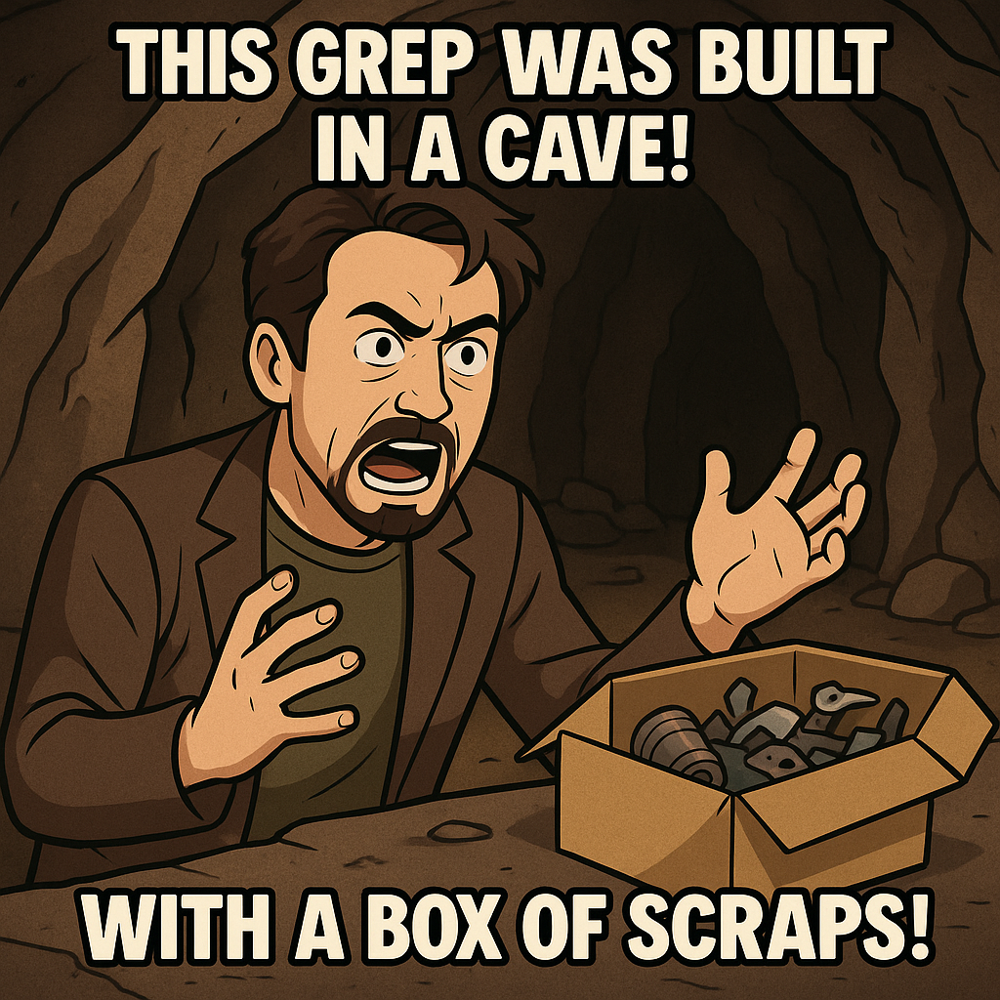

# crep
"A dime store grep program written in C++"

## About this Project:
This prog was written as part of learning C++. In its current state,
it's likely not any more dependable than the title suggests.  :)

## Goals:
- [x] Basic case-sensitive search
- [ ] Case-insensitive
- [x] Line numbers
- [ ] Whole-word match (bounded by spaces?)
- [ ] Regex
- [ ] Multiple files (recurse dir)
- [ ] Invert match ?
- [ ] Match count
- [ ] Context lines ?
- [ ] Stdin support ?
- [ ] Output formatting (color, filenames, etc.)
